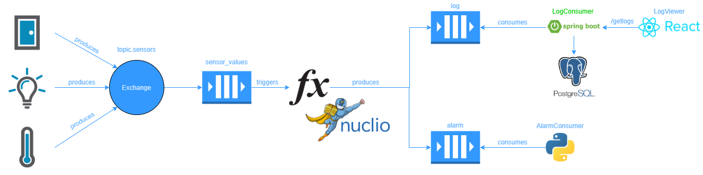
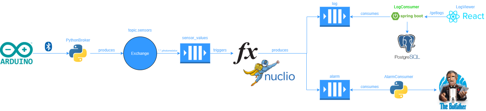
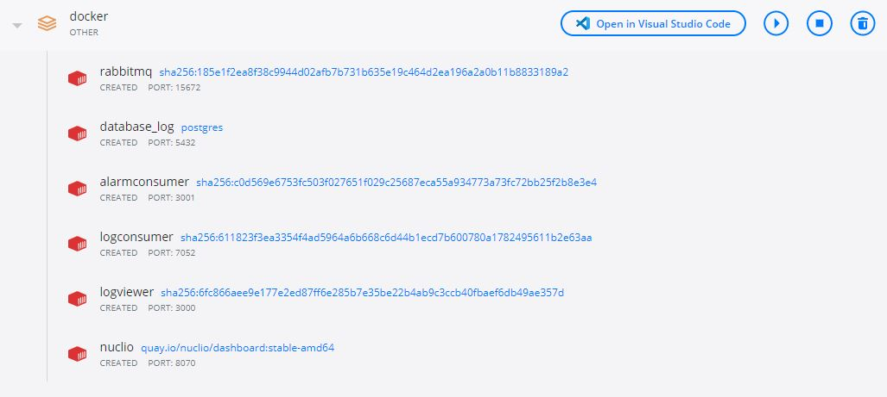

# :high_brightness: Serverless Computing for IoT
This project was made for Serverless Computing for IOT (SCIOT) exam in University of Salerno (2020-21). The aim of it is to build an application that take advantage of FaaS (Function as a Service) and to show its potential in the Internet of Things (IoT) world.
### :clipboard: Structure
* **[Architecture](#-architecture)**
* **[Description](#-description)**
* **[Prerequisites](#-prerequisites)**
* **[Installation](#-installation)**
## 🚀 Architecture
<p align="center"></p>
The main purpose of this architecture is to create a way to manipulate raw data that sensors transmit to give a standard format and to send this data to logging services and eventually notify users if these values are not correct.
 
## 🔬 Description
My version uses an Arduino Uno with a photoresistor that simulates an alarm (covered by default) that emit an alarm sound with  a "piezo" if the captured values exceeds a threshold (the sketch could be found [here](./arduino_sketch_serverless/arduino_sketch_serverless.ino) ). These values are sent through a Bluetooth module (HC-05) and captured by a receiver  [python broker](./PythonBroker) who sends them to a MQTT topic exchange in a queue (called sensor_values) that listen on *.*.photoresistor. At this point Nuclio comes in action and triggers the [consumer function](./functions/consumer_function.yml) who gets the data, normalize it in a standard format and sent them on a log queue and eventually (it depends on the severity) on an alarm queue. A [log consumer](./logconsumer) listen on the log queue and when messages arrives it saves them on a simple PostgreSQL [database](./dbscript/creazionedb.sql). The consumer also exposes a "getlogs" REST that sends all of them to a simple [REACT](./logviewer/logviewerapp) application that visualize it. Last component is the [alarm consumer](./AlarmConsumer) that listen the alarm queue and notify through a telegram bot the designed user.
<p align="center"></p>

## 🎏 Prerequisites
   - Docker and Docker Compose (Application containers engine)
   - Nuclio (Serverless computing provider)
   - RabbitMQ (AMQP and MQTT message broker)
   - Python
   - Java
   - ArduinoIDE

## 🔮 Installation
Simply clone the project, got to the docker folder and run*:
```sh
$ docker-compose up --no-start
```
At this point you can start each container, the only mandatory thing is to start first the rabbit container (just because the first time a [script](./docker/init.sh) that creates the users must be executed). Once that all the container are runned, go to Nuclio dashboard, deploy the function and then start the IoT device and the python broker to get started.
<p align="center"></p>

>*:warning: Before running the command change the env variables and some configuration:
>- AlarmConsumer: change ENV_BOT_TOKEN (the telegram bot token), CHAT_ID (the chat ID between the user to be notified and the telegram bot, USERNAME (the RabbitMQ username), PASSWORD (the RabbitMQ password) in the dockerfile.
>- PythonBroker: change the user and password in main file.
>-  Consumer_function: Change URL of trigger topic and after importing it in Nuclio also change the host variable.
>- LogConsumer:  change RABBIT_USER_USERNAME, RABBIT_USER_PASSWORD, RABBIT_QUEUE_NAME, RABBIT_HOST in the dockerfile.
>
>If you create a new users don't forget to change the [init](./docker/init.sh) script according with your changes.
